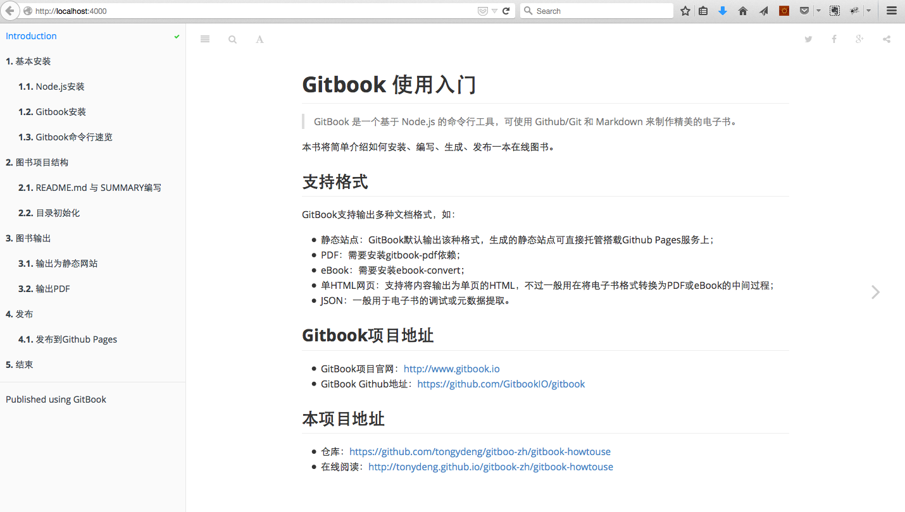

# 输出为静态网站

你有两种方式输出一个静态的网站：

## 本地预览是自动生成

当你编辑好 gitbook 文档之后，你可以使用 gitbook 的命令来进行本地预览。

```bash
$ gitbook serve ./{book_name}
```

gitbook会启动一个`4000`端口用于预览。

比如，通过`gitbook serve`来预览本文档：

```bash
$ gitbook serve gitbook-howtouse

Press CTRL+C to quit ...

Live reload server started on port: 35729
Starting build ...
Successfully built!

Starting server ...
Serving book on http://localhost:4000
```

你可以你的浏览器中打开这个网址： http://localhost:4000



你会发现，在你编辑的gitbook项目的目录中会多一个```_book```目录，而这个目录中就是生成的本地预览的静态网站内容。

## 使用gitbook build参数

与直接预览生成的静态网站不一样的时，使用这个命令，你可以将内容输出到你想要的目录。如果不使用 `--output` 参数则默认在当前文件夹下

```
$ gitbook build --output=/tmp/gitbook
Starting build ...
Successfuly built !
$ ls /tmp/gitbook/
howtouse          search_index.json
book              imgs              output
gitbook           index.html        publish
```

无论哪种方式，你都可以将这个静态网站打包，发布到你想要发布的服务器上，或者直接将这个打包文件给阅读者。
